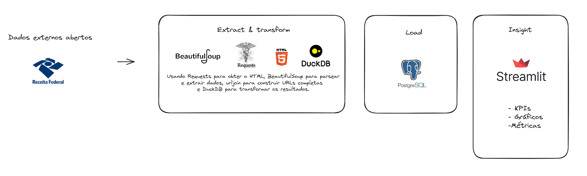

# Dados de Empresas Brasil - CNPJ

## Descrição
Este projeto visa construir um Datahouse para ingestão de dados de empresas com CNPJ a partir da base de dados do governo federal do Brasil.

## Estrutura do Projeto
- **`src`**: Código fonte para processamento e ingestão de dados.
- **`utils`**: Funções auxiliares e utilitários.
- **`layout-cnpj-metadados.pdf`**: Documentação dos metadados dos arquivos CNPJ.
- **`.gitignore`**: Arquivos e diretórios ignorados pelo Git.
- **`poetry.lock` e `pyproject.toml`**: Configurações do Poetry para gerenciamento de dependências.

## Tecnologias Utilizadas
- **Python**: Linguagem de programação principal.
- **DuckDB**: Banco de dados analítico embutido.
- **Requests**: Biblioteca para fazer requisições HTTP.
- **BeautifulSoup**: Biblioteca para parsing de HTML.
- **Poetry**: Ferramenta para gerenciamento de dependências e packaging.